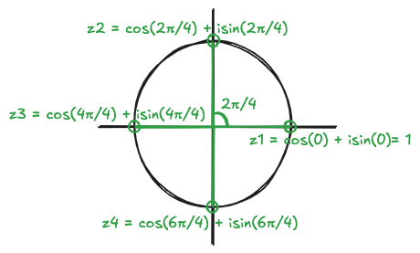
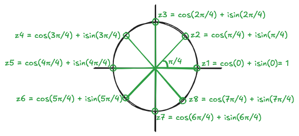
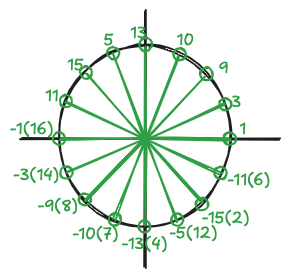

# Roots of Unity: An Introduction

## What is a Root of Unity?
A **root of unity** is a complex number $z$ that satisfies the equation:

$$
z^n = 1
$$

where $n > 0$. The goal is to find all $z$ values such that, when raised to the power of $n$, they equal 1.

## Roots of Unity in the Complex Field
In the complex field, we can use Euler's formula to find roots of unity. Euler’s formula states:

$$
e^{ix} = \cos(x) + i\sin(x)
$$

For $x = 2\pi$, we get:

$$
e^{i2\pi} = \cos(2\pi) + i\sin(2\pi) = 1
$$

This means that $e^{i2\pi}$, $e^{i4\pi}$, and $e^{i6\pi}$ all equal 1, as they correspond to rotations by full circles on the complex plane.

## Finding the $n$-th Roots of Unity
To find all the $n$-th roots of unity, we generalize using Euler's formula. The equation $z^n = 1$ can be written as:

$$
z = e^{2k\pi i/n} = \cos\left(\frac{2k\pi}{n}\right) + i\sin\left(\frac{2k\pi}{n}\right)
$$

where $k = 0, 1, 2, \dots, n-1$. There are $n$ distinct roots of unity because after $k = n-1$, the values cycle back to previously found roots.

## Visualizing Roots on the Unit Circle
Each root divides the unit circle into $n$ equal parts. For example:

- **For $n = 4$**: The roots of $z^4 = 1$ divide the circle into four equal sections, each separated by an angle of $\pi/2$ radians.
- **For $n = 8$**: The roots of $z^8 = 1$ divide the circle into eight equal sections, each separated by an angle of $\pi/4$ radians.

Here is a diagram that illustrates the positions of the roots for $n = 4$:

Here is a diagram that illustrates the positions of the roots for $n = 8$:

## Roots of Unity in Finite Fields

The concept of roots of unity also extends to finite fields. In a finite field, every nonzero element is a root of unity. For example, consider the finite field $F_{17} = \{0, 1, 2, 3, \dots, 16\}$. In this field, the equation:

$$
z^{16} \equiv 1 \mod 17
$$

is satisfied by all nonzero elements of $F_{17}$.

## Primitive Root of Unity

In a finite field, the **primitive root of unity** is the smallest number that can generate all nonzero elements of the field when raised to successive powers. Let’s find the primitive root in $F_{17}$:

- **For $a = 1$**: The powers of 1 just give $\{1\}$, so 1 is not a primitive root.
- **For $a = 2$**: The powers of 2 modulo 17 give $\{2, 4, 8, 16, 15, 13, 7, 1\}$, but this does not cover all the nonzero elements.
- **For $a = 3$**: The powers of 3 modulo 17 generate all nonzero elements of $F_{17}$, so 3 is a primitive root.

## Conclusion
By using Euler’s formula in the complex field and modular arithmetic in finite fields, we can find the roots of unity and primitive roots of unity. The concept is crucial in fields like number theory, cryptography.
